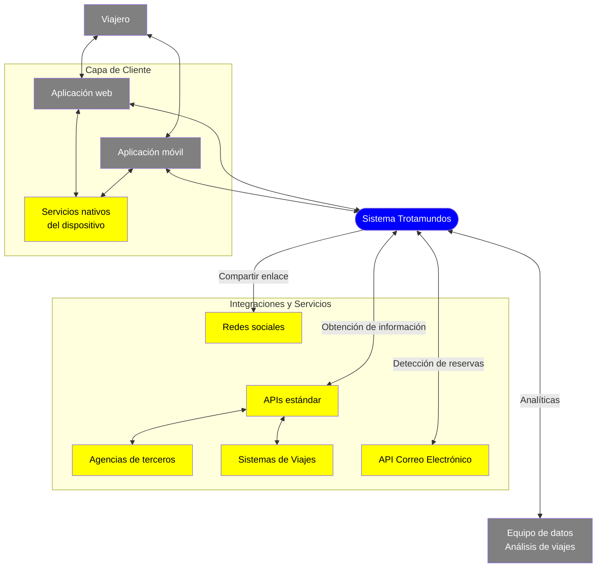

# Diagrama de Contexto

```mermaid
flowchart TB
    Viajero["Viajero"]

    subgraph Clientes ["Capa de Cliente"]
        Web["Aplicación web"]
        App["Aplicación móvil"]
        ServiciosNativos["Servicios nativos<br/>del dispositivo"]
    end

    Datos["Equipo de datos<br/>Análisis de viajes"]
    Sistema(["Sistema Trotamundos"])


    subgraph Integraciones ["Integraciones y Servicios"]
        direction TB
        APIs["APIs estándar"]
        Agencias["Agencias de terceros"]
        SistemasDeViajes["Sistemas de Viajes"]
        Correo["API Correo Electrónico"]
        Redes["Redes sociales"]
    end

    Viajero <--> Web
    Viajero <--> App
    App <--> ServiciosNativos
    Web <--> ServiciosNativos

    Web <--> Sistema
    App <--> Sistema

    Sistema <--> |"Obtención de información"| APIs
    APIs <--> Agencias
    APIs <--> SistemasDeViajes

    Sistema --> |"Compartir enlace"| Redes
    Sistema <--> |"Detección de reservas"| Correo
    Sistema <--> |"Analíticas"| Datos

    Web ~~~ App
    App ~~~ ServiciosNativos
    Redes ~~~ APIs ~~~ Correo ~~~ Datos

    classDef core fill:#0000ff,color:#ffffff
    classDef actor fill:#808080,color:#ffffff
    classDef external fill:#ffff00,color:#000000
    class Sistema core
    class Viajero,Web,App,Datos actor
    class Agencias,SistemasDeViajes,APIs,Correo,Redes,ServiciosNativos external
```

- Azul: Sistema propio
- Amarillo: Sistemas externos
- Gris: Actores
